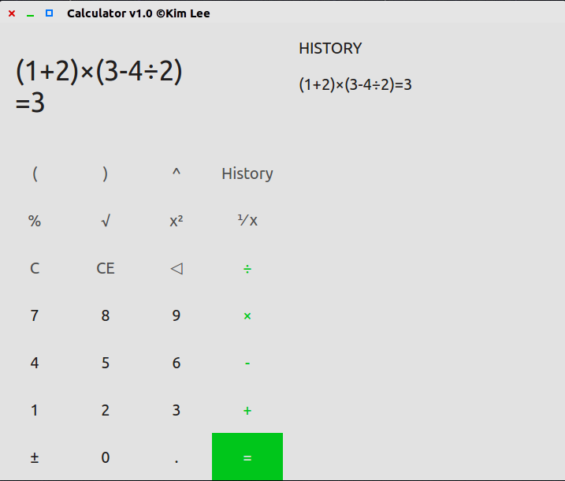
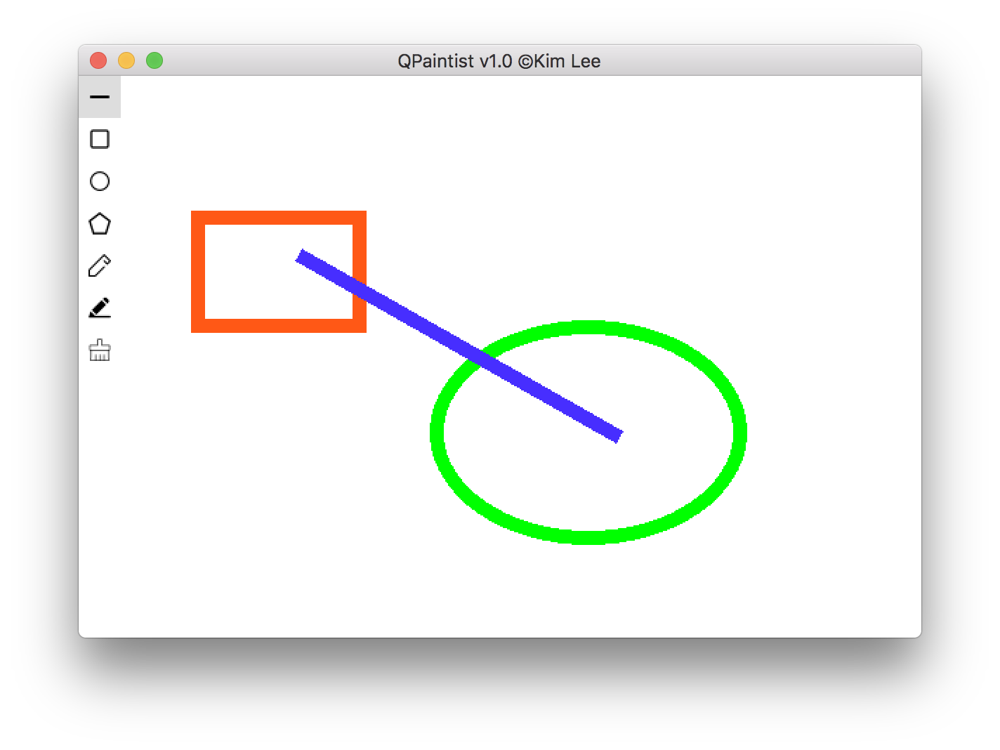

[To Git Page](https://cjhahaha.github.io/QT-practice/)

##  Calculator
1. contents
- calculator.pro
- calculator.pro.user
- header file/
	-- expression.h
	-- widget.h
- source file/
	-- expression.cpp
	-- widget.cpp
- assests
	-- icon.qrc
	-- icon.rc
	-- app.ico

/*
expression.h & expression.cpp : convert expression into values
```cpp
string exp = "1+2*(3-4)"
Expression * e = new Expression(exp);
string res = e -> getValue();
```
*/
2. functions
- record history
- consecutive calculation

3. preview
 


## QPaintist
1. contents
- QPaintist.pro
- QPaintist.pro.user
- header file/
	-- canvas.h
	-- widget.h
- source file/
	-- canvas.cpp
	-- widget.cpp
- assests/
	-- circle.png
	-- clear.png
	-- line.png
	-- penColor.png
	-- penWeight.png
	-- polygon.png
	-- square.png
	
/*
canvas.h & canvas.cpp : provide painting area
*/

2. functions
- paint
- add basic shape, such as line, circle, polygon, square and etc.

3. preview


4. hint
**Please copy folder assests to the application dir**