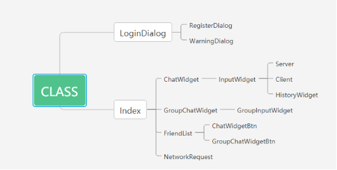

# QT practice

几个自己做的QT小项目。包括

- Calculator 计算器

- QPaintist 画板
- IM 局域网通讯


##  Calculator

1. preview 展示
   

2. contents 项目结构

- calculator.pro
- calculator.pro.user
- header file/
  - expression.h
  - widget.h
- source file/
  - expression.cpp
  - widget.cpp
- assests
  - icon.qrc
  - icon.rc
  - app.ico

expression.h & expression.cpp : convert expression into values
```cpp
string exp = "1+2*(3-4)"
Expression * e = new Expression(exp);
string res = e -> getValue();
```
3. functions

- record history
- consecutive calculation 


## QPaintist

1. preview
   

2. contents

- QPaintist.pro

- QPaintist.pro.user

- header file/

  - canvas.h
  - widget.h

- source file/

  - canvas.cpp
  - widget.cpp

- assests/

  - icon.qrc


  - circle.png
  - clear.png
  - line.png
  - penColor.png
  - penWeight.png
  - polygon.png
  - square.png
canvas.h & canvas.cpp : provide painting area

3. functions

- paint
- add basic shape, such as line, circle, polygon, square and etc.


## IM

1. preview

- login dialog
- chat widget
  
- file transfer
  

2. contents
   

3. functions

- Instant message based on UDP (chat with one & group chat)
- file transfer based on TCP
- record chat history
